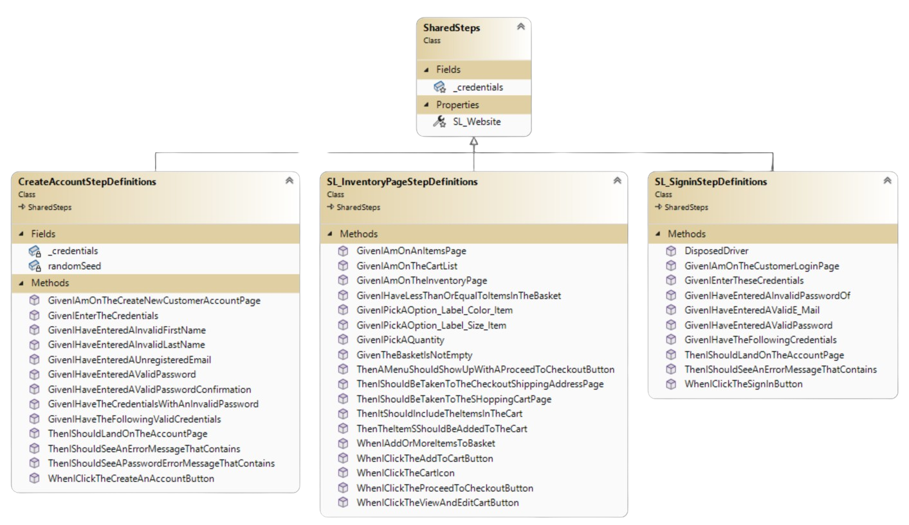
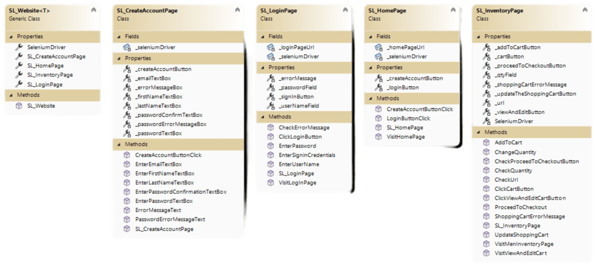

# Luma Web Testing Project using Selenium and Specflow

## This is a web testing project on [the Luma software testing website](https://magento.softwaretestingboard.com/) that utilises Selenium, Specflow, Accessibility Testing and Exploratory Testing.

🥅 [Testing Aims](#🥅-testing-aims) | 🎉️ [Epics](#🎉️-epics) | 🏷 [Class Diagram](#🏷-class-diagram) | 🚢 [Exploratory Testing](#🚢-exploratory-testing) |
🗺 [Accessibility Testing](#🗺-accessibility-testing) | ❌ [Defect Reports](#❌-defects-reports) |
💭 [Definitions of Done and Ready](#💭-definitions-of-done-and-ready) | 📝 [Project Board](#📝-project-board) | 🤺 [Contributors](#🤺-contributors)

---

### 🥅 Testing Aims

The testing aims of this project are...

* [ ] To have an up to date project board
* [ ] To have high quality user stories and test cases
* [ ] To have very clear Gherkin scenarios derived from user stories represent the user journeys
* [ ] To have a fully functional test framework using POM pattern
* [ ] Well documented defect reports
* [ ] Exploratory Test Charters
* [ ] GitHub Action Workflows

---

### 🎉️ Epics

Epic 1.0 - Signin

1.1  AS a registered user  I WANT TO login to the system  SO THAT only I can access my account   1.2  AS a registered user  I WANT TO request a new password  SO THAT I can access my account  1.3  AS a registered user  I WANT TO be able to change my password  SO THAT my account is secure

Epic 2.0 - Create Account

2.1  AS a new user  I WANT TO signup on Luma with valid credentials  SO THAT so I can have an account  2.2  AS a new user  I WANT TO be prompted if my credentials aren't valid  SO THAT so I amend my credentials  2.3  AS a new user  I WANT TO be prompted if my password isn't strong enough  SO THAT so I can amend it  2.4  AS a new user  I WANT TO be prompted if I try to create an account with an already registered email SO THAT so I know to signin, not signup.

Epic 3.0 - Navigation

2.1  AS A Luma user  I WANT TO be taken to the correct page when I click a link  SO THAT I can easily navigate  2.2  AS A Luma user  I WANT TO be relevant dropdowns to be displayed when I hover over a navigation header  SO THAT I can easily navigate

Epic 4.0 - Signin

4.1   AS A registered user  I WANT TO be able to add an item(s) to the cart  SO THAT I can buy items 4.2   AS A registered user  I WANT TO be able to add a large number of items to my basket
 SO THAT I can buy items in bulk  4.3  AS A registered user  I want the cart icon to show me my items  SO THAT I can see if I have added the correct items to the basket 

Epic 5.0 - Searchbar

5.1   AS A Luma user  I WANT TO relevant products and results to be returned when I search a term  SO THAT I can easily find products

 

### 🏷 Class Diagram

A Class Diagram for Automated Test Functions

A Class Diagram for the Page Object Model

 

### 🚢 Exploratory Testing

We carried Exploratory Testing on all our Epics to supplement our automated testing. The links to our Test Charters and Test Cases are attached below.

* [ ] [Epic 1.0 - Signin](https://drive.google.com/drive/folders/1bQZ-y8z6K7P_c7QnnWDM34YowUi9qQ-x?usp=share_link)
* [ ] [Epic 2.0 - Create Account](https://drive.google.com/drive/folders/185aEqa-vtyUK_CrELnw9sOGPT_M397h8?usp=share_link)
* [ ] [Epic 3.0 - Navigation](https://drive.google.com/drive/folders/1NvtlIi4lHZ3bysir2qNoTz4hsuqQjPEa?usp=share_link)
* [ ] [Epic 4.0 - Buying Items](https://drive.google.com/drive/folders/1R_b7zjIYdjDOvKBHcMI3hF5gF4EoH5Hv?usp=share_link)
* [ ] [Epic 5.0 - Searchbar](https://drive.google.com/drive/folders/16jjiAilnOMSfckMFn-YbefsdBG2kaMKI?usp=share_link)

### 🗺 Accessibility Testing

We carried some Accessibility Testing. The key takeaway from this testing was that certain elements of the website weren't intuitively in sequence and other elements weren't accessible at all. Our full report [can be found here](https://drive.google.com/drive/folders/1oBh03-AduD9liG7J4TVAnJMtVbZfJkpR?usp=share_link)

### ❌ Defects Reports

Our [open defect reports can be found here](https://drive.google.com/drive/folders/1mGbFK7zAuXJb4K-djAReCqDfZ2ipEwOt?usp=sharing). They relate to accessibility defects which violate the lowest level of Web Content Accessibility Guidelines and to defects around basic functionality around purchasing certain products.

---

### 📝 Project Board

Our up-to-date GitHub project board [can be found here](https://github.com/users/SamuelTheSpartan/projects/1/views/1)

### 💭 Definitions of Done and Ready

Our definitions of Done and Ready [can be found here](./Defintions%20of%20Done%20and%20Ready/Definitions%20of%20Done%20and%20Ready.md)

### 🤺 Contributors

Samuel Burton, Lucas Brennan, Man Him Yeung, Glen Smith, Gharzay Wali, Ali Cengiz, Suheyb Adam, Cormac Porter, Kevin Conceicao

---

[The Project Website](https://magento.softwaretestingboard.com/)

[Project Board](https://github.com/users/SamuelTheSpartan/projects/1/views/1)

### Other deliverables

* [ ] A README.md that includes all your documentation of what you have tested and how to run your test framework. Should also include how to use and extend your framework
* [ ] Using GitHub collaboratively
* [ ] Present your work at 9.30am on Wednesday 12th April (everyone in the group must partake – treat like a final presentation)
